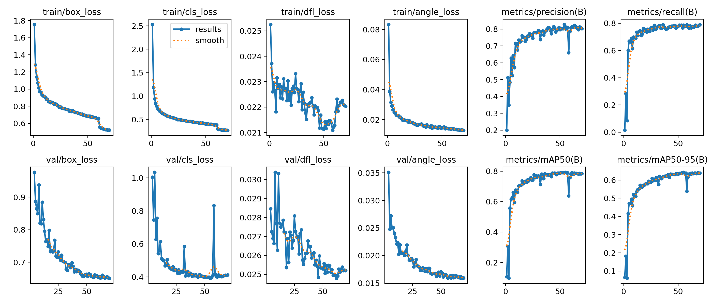
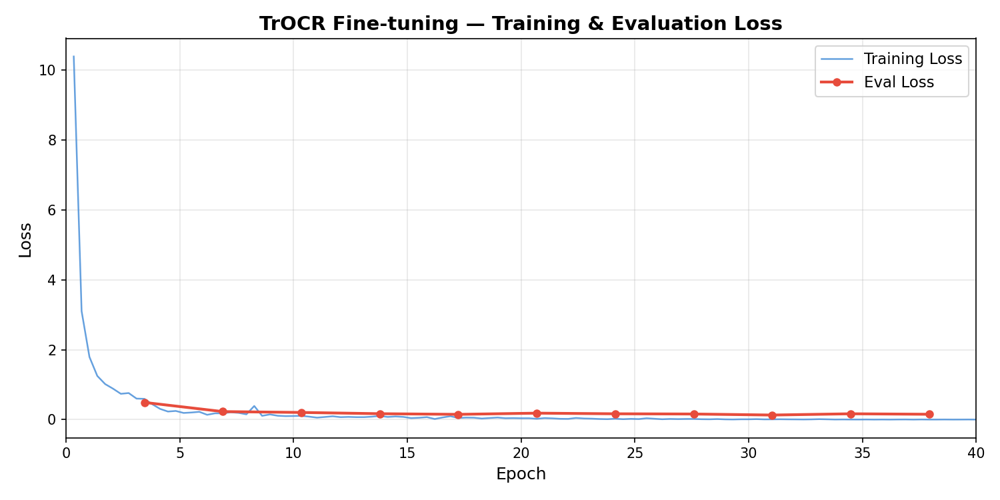
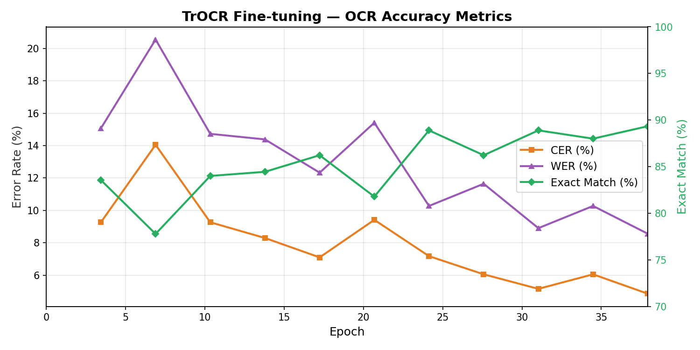

# Kiến trúc Hệ thống PillOCR — Tài liệu Mô tả Luồng (Flow)

Hệ thống PillOCR được thiết kế để giải quyết bài toán: **Phát hiện các viên thuốc trong một bức ảnh và trích xuất nội dung chữ được in trên bề mặt của chúng**.

Kiến trúc cốt lõi sử dụng một pipeline hai giai đoạn nối tiếp nhau: mô hình **YOLO OBB** đảm nhiệm việc khoanh vùng vị trí viên thuốc và vùng chứa chữ, sau đó mô hình **TrOCR** sẽ tiến hành đọc nội dung chữ từ các vùng đã được cắt xén. Hệ thống được chia làm hai luồng (flow) chính: Luồng chuẩn bị dữ liệu (Data Pipeline) và Luồng xử lý trực tiếp (Inference Pipeline).

---

## Phần 1: Luồng Chuẩn bị Dữ liệu Huấn luyện (Data Pipeline)

Mục tiêu của luồng này là biến đổi các bức ảnh thô chụp bàn thuốc thành một tập dữ liệu chuẩn mực, sạch sẽ và cân bằng để huấn luyện mô hình YOLO OBB. Quá trình này đi qua 4 cột mốc chính:

### 1. Khởi tạo nhãn tự động (Auto-Annotation)

Hệ thống không bắt đầu bằng việc gán nhãn thủ công từ con số không. Ảnh gốc sẽ được đưa qua framework OCR có sẵn (Apple VisionKit) để tự động quét và nhận diện các vùng chứa chữ. Kết quả trả về là tọa độ các hộp chữ (bounding box) và nội dung chữ thô.

### 2. Kiểm duyệt và Tinh chỉnh (Human-in-the-loop)

Vì OCR tự động thường gặp khó khăn với tên thuốc tiếng Việt hoặc các từ viết tắt chuyên ngành, dữ liệu thô sẽ được chuyển cho người kiểm duyệt. Người này sẽ đối chiếu ảnh cắt của từng viên thuốc với chữ nhận diện được để sửa lại cho chính xác, tạo ra một bộ dữ liệu chuẩn (Ground Truth).

### 3. Đồng bộ và Chuyển đổi Định dạng (Data Consolidation)

Dữ liệu từ nhiều nguồn (tọa độ viên thuốc gốc, tọa độ chữ từ VisionKit, nội dung chữ đã sửa) được tổng hợp lại để tạo thành định dạng chuẩn cho YOLO OBB với 2 nhãn (class) chính: `pill` (viên thuốc) và `text_zone` (vùng chữ). Quá trình xử lý ở bước này bao gồm:

- **Chuẩn hóa hướng ảnh:** Gắn cứng thông số xoay ảnh (EXIF rotation) vào dữ liệu pixel thực tế để đảm bảo tọa độ không bị lệch.
- **Đồng bộ hệ tọa độ:** Đưa toàn bộ các loại hộp (AABB, OBB) về chung một hệ quy chiếu và chuẩn hóa theo tỷ lệ kích thước ảnh.
- **Cân bằng dữ liệu:** Trộn thêm các ảnh chỉ có viên thuốc (không có chữ) để hệ thống không bị thiên kiến.

### 4. Gia tăng Dữ liệu (Augmentation)

Vì số lượng vùng chứa chữ (`text_zone`) thường ít hơn rất nhiều so với số lượng viên thuốc, hệ thống sẽ tự động nhân bản và biến đổi các vùng chữ này (xoay, lật, thay đổi độ sáng, thêm nhiễu). Điều này giúp làm phong phú dữ liệu và tăng tính dẻo dai (robustness) cho mô hình khi huấn luyện.

---

## Phần 2: Luồng Xử lý Trực tiếp (Inference Pipeline)

Đây là luồng hoạt động khi người dùng tải một bức ảnh lên ứng dụng. Dữ liệu sẽ chảy qua một hệ thống phễu lọc và biến đổi liên tục để cho ra kết quả cuối cùng.

### 1. Phát hiện đối tượng (Detection)

Ảnh toàn cảnh được đưa vào mô hình YOLO OBB. Mô hình này sẽ quét và trả về tọa độ của tất cả các viên thuốc và các vùng chữ có trong ảnh, kèm theo độ tự tin (confidence score). Các hộp tọa độ này được vẽ nghiêng bám sát theo hình dáng thực tế của đối tượng.

### 2. Lọc nhiễu theo Không gian (Spatial Filtering)

Trong thực tế, ảnh có thể chứa nhiều vùng chữ không liên quan (chữ trên vỉ thuốc, bao bì xung quanh). Hệ thống sẽ loại bỏ nhiễu bằng thuật toán đối chiếu sự bao hàm (Containment). Một vùng chữ chỉ được giữ lại xử lý tiếp nếu nó nằm gọn bên trong ranh giới của một viên thuốc với tỷ lệ diện tích giao nhau đạt ngưỡng cho phép (trên 30%).

### 3. Trích xuất Vùng chữ (Perspective Crop)

Để mô hình OCR có thể đọc tốt, vùng chữ nghiêng cần được trích xuất và "duỗi thẳng" thành một hình chữ nhật chuẩn. Luồng xử lý bắt buộc phải lấy dữ liệu từ **bức ảnh gốc nguyên bản**, không chứa bất kỳ đường nét vẽ hộp hay nhãn mác nào từ bước Detection, nhằm đảm bảo đầu vào cho OCR là "sạch" nhất.

### 4. Định hướng và Tiền xử lý (Orientation & Preprocessing)

Chữ trên viên thuốc có thể bị lộn ngược hoặc xoay ngang. Hệ thống xử lý vấn đề này qua hai cơ chế song song:

- **Định hướng đa chiều:** Hệ thống có thể tự động thử xoay và lật ảnh theo 24 tổ hợp khác nhau để tìm ra góc độ dễ đọc nhất dựa trên cơ chế bầu chọn (Majority Vote).
- **Tiền xử lý song song:** Ảnh được chạy qua hai bộ lọc hình ảnh khác nhau cùng lúc (một bộ tối ưu cho ảnh rõ nét, một bộ tối ưu cho ảnh thừa/thiếu sáng).

### 5. Nhận diện Ký tự (Recognition)

Các bức ảnh nhỏ đã được duỗi thẳng, xoay đúng chiều và cân bằng sáng sẽ được đưa vào mô hình TrOCR. Mô hình này dịch các đặc điểm hình ảnh thành một chuỗi ký tự và trả về tên thuốc hoặc hàm lượng in trên viên thuốc.

---

## Phần 3: Các Quyết định Kiến trúc Quan trọng

Để luồng xử lý trên hoạt động trơn tru, kiến trúc này phụ thuộc vào một số thiết kế cốt lõi:

- **Bỏ qua IoU, sử dụng Containment:** Do vùng chữ luôn nhỏ hơn viên thuốc rất nhiều, việc dùng chỉ số IoU truyền thống để xem vùng chữ có nằm trong viên thuốc không là không khả thi. Thiết kế sử dụng tỷ lệ Containment (diện tích giao / diện tích vùng chữ) phản ánh đúng bản chất vật lý của bài toán hơn.
- **Cơ chế "Bầu chọn" (Majority Vote) để định hướng:** Thay vì dùng các quy tắc cứng nhắc (như chữ phải từ trái sang phải), việc thử nghiệm mọi góc xoay và chọn kết quả xuất hiện nhiều nhất giúp hệ thống cực kỳ bền bỉ trước các loại font chữ lạ hoặc cách in dọc, in ngược trên thuốc.
- **Chấp nhận dự phòng trong tiền xử lý (Redundancy):** Việc bắt buộc chạy hai phương pháp cân bằng sáng song song cho thấy hệ thống ưu tiên độ chính xác cao nhất (accuracy) hơn là tối ưu hóa tốc độ xử lý phần cứng.

---

## Phần 4: Kết quả Huấn luyện YOLO OBB

Mô hình YOLO OBB được huấn luyện để phát hiện hai loại đối tượng: `pill` và `text_zone`. Biểu đồ dưới đây tổng hợp toàn bộ quá trình huấn luyện.

### Giải thích các Metrics

| Metric         | Ý nghĩa                                                                                                         |
| -------------- | --------------------------------------------------------------------------------------------------------------- |
| **box_loss**   | Lỗi tọa độ hộp — đo độ chính xác vị trí và kích thước hộp mô hình dự đoán so với Ground Truth.                  |
| **cls_loss**   | Lỗi phân loại — đo mức độ chính xác khi phân biệt `pill` và `text_zone`.                                        |
| **dfl_loss**   | Distribution Focal Loss — giúp mô hình dự đoán biên hộp chính xác hơn bằng cách mô hình hóa phân phối xác suất. |
| **angle_loss** | Lỗi góc xoay — riêng cho OBB, đo độ lệch góc của hộp nghiêng so với Ground Truth.                               |
| **Precision**  | Tỷ lệ dự đoán đúng — trong tất cả hộp mô hình phát hiện, bao nhiêu phần trăm thực sự đúng.                      |
| **Recall**     | Tỷ lệ phát hiện đúng — trong tất cả đối tượng thực tế, bao nhiêu phần trăm được mô hình tìm thấy.               |
| **mAP50**      | Mean Average Precision tại IoU ≥ 0.5 — chỉ số đánh giá tổng hợp ở ngưỡng trùng lặp 50%.                         |
| **mAP50-95**   | Mean Average Precision trung bình từ IoU 0.5 đến 0.95 — phép đo nghiêm ngặt nhất của COCO.                      |

> **Nhận xét:** Cả 4 thành phần loss (train lẫn val) đều giảm ổn định và hội tụ. Precision/Recall đạt ~80%, mAP50 ~80% và mAP50-95 ~65%, cho thấy mô hình phát hiện viên thuốc và vùng chữ tốt ở nhiều mức IoU khác nhau.

---

## Phần 5: Kết quả Huấn luyện TrOCR

Mô hình TrOCR được fine-tune trên tập dữ liệu tên thuốc tiếng Việt trong 40 epoch. Dưới đây là diễn biến quá trình huấn luyện.

### Biểu đồ 1 — Training & Evaluation Loss

Training loss giảm mạnh từ **10.39 → 0.001** trong 40 epoch, cho thấy mô hình hội tụ tốt. Eval loss ổn định quanh mức **0.13–0.17** từ epoch 15 trở đi, không có dấu hiệu overfit nghiêm trọng.

### Biểu đồ 2 — OCR Accuracy Metrics

Các chỉ số đánh giá chất lượng OCR cải thiện liên tục qua quá trình huấn luyện, đạt kết quả tốt nhất tại epoch 38.

### Giải thích các Metrics

| Metric                         | Ý nghĩa                                                                                                      | Best      |
| ------------------------------ | ------------------------------------------------------------------------------------------------------------ | --------- |
| **CER** (Character Error Rate) | Tỷ lệ lỗi ở **cấp ký tự** — số ký tự cần thêm/xóa/sửa chia cho tổng ký tự. CER thấp = đọc đúng từng ký tự.   | **4.86%** |
| **WER** (Word Error Rate)      | Tỷ lệ lỗi ở **cấp từ** — số từ sai chia cho tổng số từ. WER luôn ≥ CER vì sai một ký tự cũng tính sai cả từ. | **8.56%** |
| **Exact Match**                | Tỷ lệ mẫu mà mô hình đọc đúng **100% nội dung** — phép đo nghiêm ngặt nhất.                                  | **89.3%** |

> **Nhận xét:** Với CER ~4.9% và Exact Match ~89%, mô hình TrOCR đọc đúng hoàn toàn gần 9/10 tên thuốc. Các lỗi còn lại chủ yếu đến từ chữ mờ, font đặc biệt, hoặc chữ in dọc trên viên thuốc.
